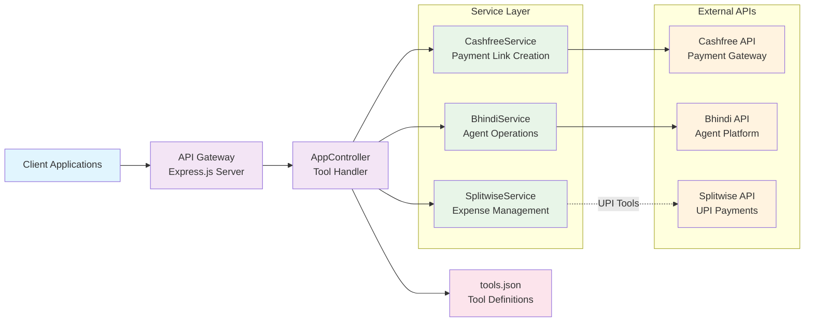
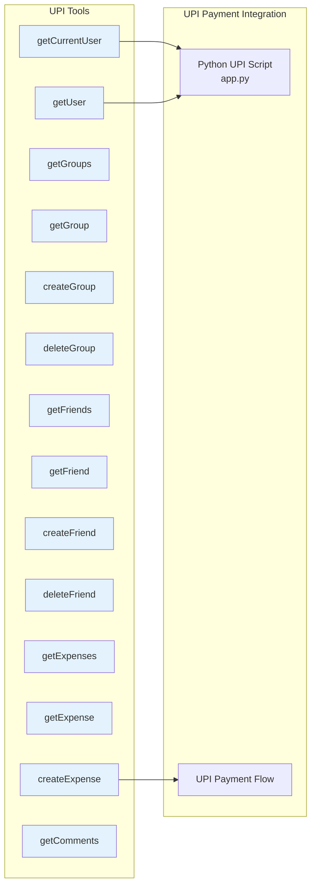
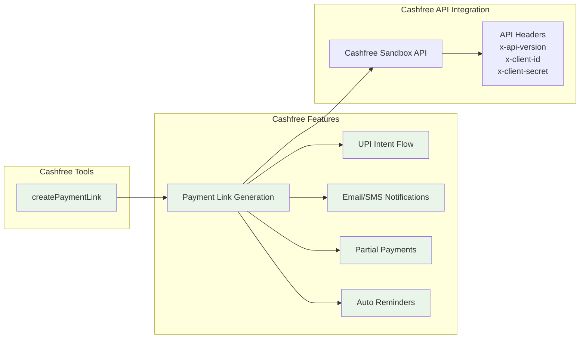
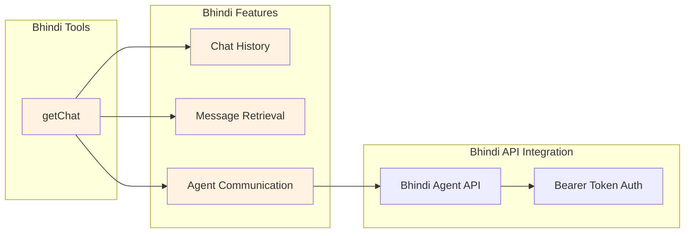
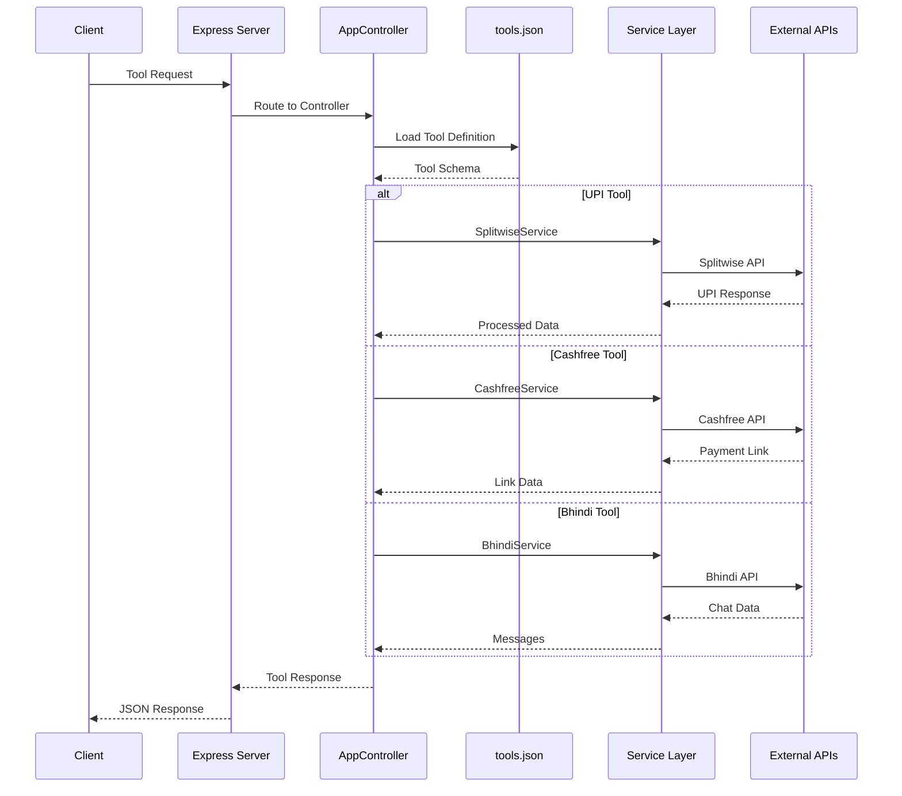
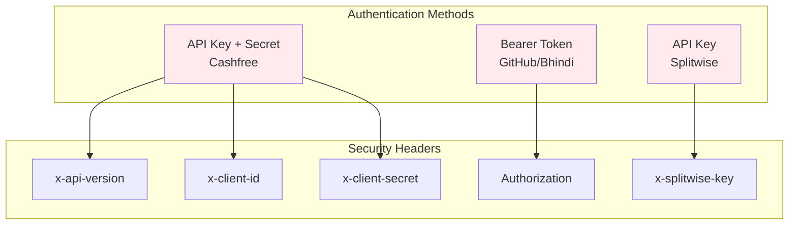

# Bhindi Agent Starter Kit - Architecture Diagram

## System Overview

This architecture diagram focuses on the three main tool categories: **UPI Tools**, **Cashfree Tools**, and **Bhindi Tools** within the Bhindi Agent Starter Kit.

## Architecture Components



## Tool Categories Breakdown

### 1. UPI Tools (via Splitwise Service)


### 2. Cashfree Tools


### 3. Bhindi Tools


## Data Flow Architecture



## Authentication & Security



## File Structure for Tool Categories

```
src/
├── controllers/
│   └── appController.ts          # Main tool handler
├── services/
│   ├── cashfreeService.ts        # Cashfree payment operations
│   ├── bhindiService.ts          # Bhindi agent operations
│   └── splitwiseService.ts       # UPI tools (via Splitwise)
├── config/
│   └── tools.json               # Tool definitions & schemas
└── app.py                       # Python UPI payment script
```

## Key Features by Tool Category

### UPI Tools (14 tools)
- **User Management**: getCurrentUser, getUser, getFriends, createFriend, deleteFriend
- **Group Management**: getGroups, getGroup, createGroup, deleteGroup
- **Expense Management**: getExpenses, getExpense, createExpense, getComments
- **Payment Integration**: Python script for direct UPI payments via Splitwise

### Cashfree Tools (1 tool)
- **Payment Link Creation**: createPaymentLink with comprehensive features
- **UPI Intent Flow**: Support for UPI-based payments
- **Notification System**: Email and SMS notifications
- **Partial Payments**: Support for installment payments
- **Auto Reminders**: Automated payment reminders

### Bhindi Tools (1 tool)
- **Chat Management**: getChat for retrieving conversation history
- **Agent Communication**: Integration with Bhindi agent platform
- **Message Retrieval**: Access to chat messages and responses

## Technology Stack

- **Backend**: Node.js with Express.js
- **Language**: TypeScript
- **Payment Gateway**: Cashfree API (sandbox)
- **UPI Integration**: Splitwise API (Python script)
- **Agent Platform**: Bhindi API
- **Configuration**: JSON-based tool definitions
- **Authentication**: Multiple auth methods (Bearer, API Key, OAuth) 
